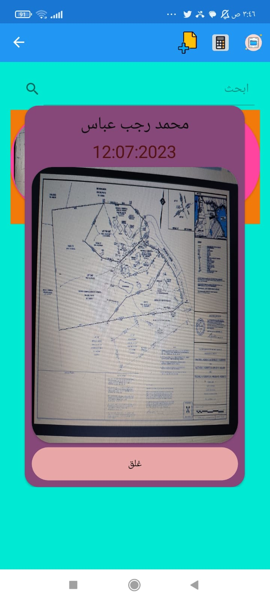

# Land Surveyor App "المساح"

> A mobile application developed with Xamarin Forms for calculating land area and managing survey data.

## Installation

To install and run the Land Surveyor App, follow these steps:

1. Clone the repository:
https://github.com/MohamedRagabAbbas/FindArea-EL_Massah.git

2. Open the project in Xamarin Studio or Visual Studio.

3. Build the project to restore NuGet packages and compile the code.

4. Deploy the app to an emulator or physical device.

## Usage

1. Upon launching the app, you will be presented with the main screen.

2. To calculate the area of a land, enter the lengths of the sides and one of the diagonals in the provided fields.

3. Tap the "Calculate" button to obtain the area of the land.

4. To save customer data and generate reports:

- Navigate to the "Customer Data" section.
- Enter the necessary information, such as customer name, organization, and any additional details.
- Capture a photo of the report or related documents using the app's camera functionality.
- Tap the "Save" button to store the customer data and report in the local storage.

5. In the future, if a customer requires the same report, you can easily access it from the stored data without the need to redo the calculations.

## Features

- Calculate the area of land by providing side lengths and a diagonal.
- Store customer data, including name, organization, and additional details.
- Capture and save photos of reports or related documents.
- Retrieve stored data and reports for future reference.

## Contributing

Contributions to the Land Surveyor App are welcome! If you'd like to contribute, please follow these guidelines:

1. Fork the repository.
2. Create a new branch for your feature or bug fix.
3. Make your modifications and ensure the code follows the project's coding conventions.
4. Test your changes thoroughly.
5. Commit your changes and push them to your forked repository.
6. Open a pull request, describing the purpose and changes of your contribution.